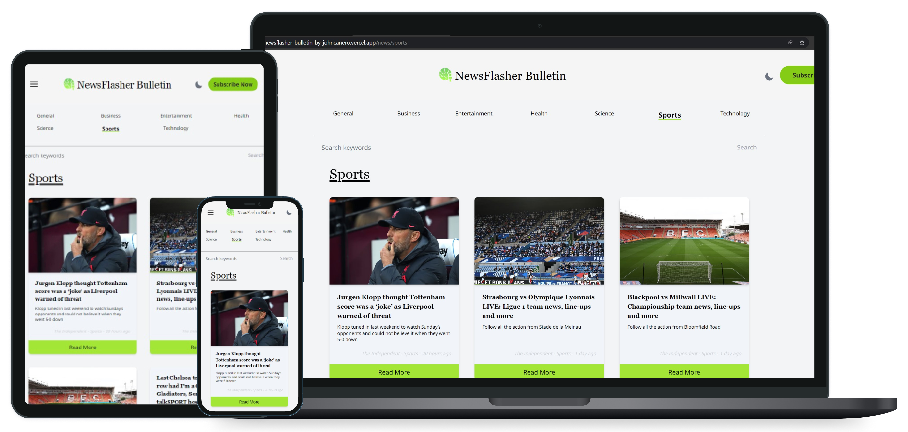
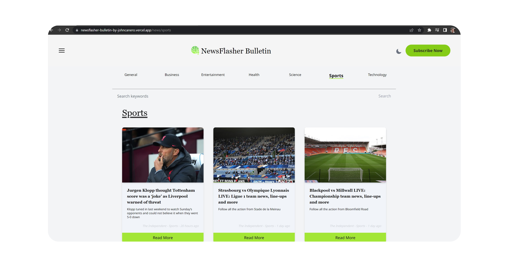
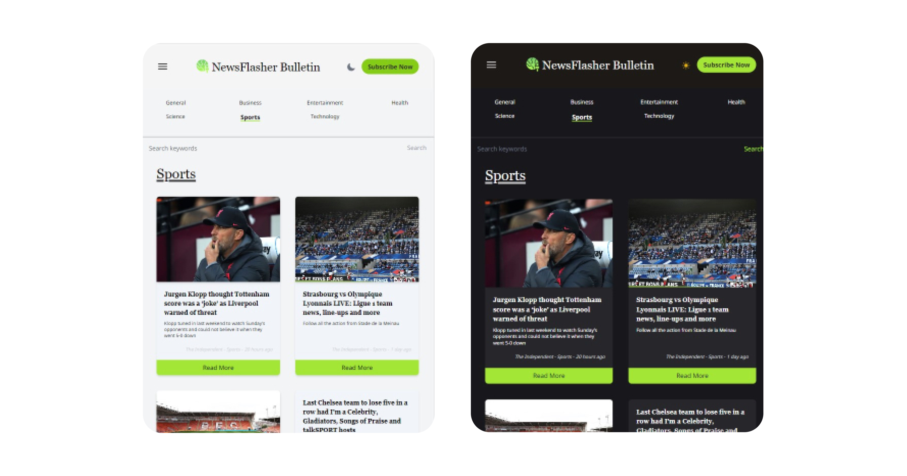

<!-- markdownlint-configure-file {
  "MD013": {
    "code_blocks": false,
    "tables": false
  },
  "MD033": false,
  "MD041": false
} -->

  

# NewsFlasher Bulletin

Newsflasher Bullletin, a comprehensive news website that provides up-to-date coverage of local, national, and international news. 

With a team of experienced journalists, we bring you the latest news, analysis, and commentary on politics, business, technology, sports, entertainment, and more

## Website

🖥️ [https://newsflasher-bulletin-by-johncanero.vercel.app/]

✍️ Project by John Cañero

## Responsive Design

🪟: [Desktop - Tablet - Mobile]

Responsive Feature Application Light

Responsive Feature Application Dark

Desktop Responsive Light

Tablet Responsive | Light and Dark

Mobile Responsive | Light and Dark

